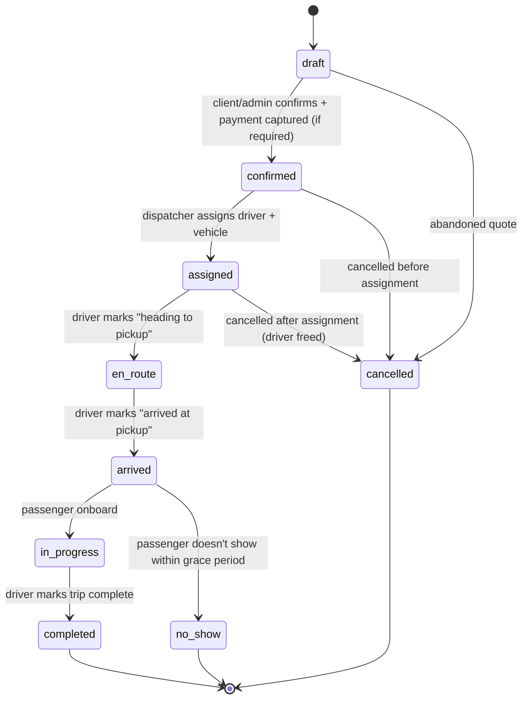

# Booking Lifecycle

Owned by the `bookings` module. This refines the state machine already referenced in `packages/core/src/bookings/README.md` (`draft → confirmed → assigned → in_progress → completed → cancelled`) with the detail needed to actually implement it.

> **Implemented today (migration 0030):** only `pending_deposit → confirmed → completed` (foreign customers) and `pending_confirmation → confirmed → completed` (italian customers), plus `cancelled` from any of them.
> - Approving a quote (Approva in the admin panel, or the admin `accept`/`modifyPrice` API) creates the booking:
>   - **foreign customer** (phone not +39): at **`pending_deposit`**, with the deposit requested — by default 50% of the total, rounded to the nearest 10 € with halves rounded up; the founder can override it in the panel's Modifica. The customer pays the balance to the driver on the day of service.
>   - **italian customer** (+39, founder decision 2026-09-26): at **`pending_confirmation`**, never with a deposit. The customer pays the driver on the day of service, in cash or by card.
> - The booking becomes **`confirmed`** only when the founder records it: "Acconto ricevuto" (foreign) or "Confermato dal cliente" (italian) in the admin panel (Preventivi in attesa, or the customer page). Only then is `booking.confirmed` emitted and the deal moved to `confirmed`, and the customer gets an automatic WhatsApp confirmation.
> - `pending_deposit` and `pending_confirmation` bookings are not conversions: every KPI counts only `confirmed`/`completed`. Bookings created from Google Calendar sync still start at `confirmed`.
> - No payment link is generated by BOS: the founder sends the SumUp link manually. See `packages/core/src/quote-approval/README.md`.
> - The full state machine below (`draft`, `assigned`, `in_progress`, `no_show`) is the target design, not yet built.

## States

| Status | Meaning | Who can trigger |
|---|---|---|
| `draft` | Quote generated, not yet a confirmed commitment. | client (web flow), admin (phone booking) |
| `confirmed` | Client has committed; payment captured or invoice-account approved. | client, admin |
| `assigned` | Driver + vehicle assigned. | dispatcher/admin (Phase 1: manual — see [Dispatch Logic](08-dispatch-logic.md)) |
| `en_route` | Driver is travelling to the pickup location. | driver (via PWA) |
| `arrived` | Driver is at the pickup location, waiting. | driver |
| `in_progress` | Passenger is in the vehicle, trip underway. | driver |
| `completed` | Trip finished. Triggers billing (see below). | driver |
| `cancelled` | Booking will not happen. Requires `cancellation_reason`. | client, admin, (driver-initiated cancellation routes through admin) |
| `no_show` | Client did not appear at pickup within the grace period. | driver, confirmed by admin |

`en_route` / `arrived` are **Phase 2** granularity (they require the driver PWA to exist). Phase 1 ships with `assigned → in_progress → completed` only, with `en_route`/`arrived` reserved in the enum from the start so Phase 2 doesn't need a schema migration to add them — it needs UI to set them.

## Guard conditions

- `draft → confirmed` requires: pickup/dropoff (or disposal duration) set, `scheduled_pickup_at` in the future, and payment success **or** an approved corporate `invoice_account` (see [Payments](06-payments.md)).
- `confirmed → assigned` requires: an `active` driver with no overlapping assignment in the pickup time window (± estimated trip duration + buffer — see [Dispatch Logic](08-dispatch-logic.md)), and an `active` vehicle of adequate `passenger_capacity`/`luggage_capacity`.
- `arrived → no_show`: only after a configurable grace period past `scheduled_pickup_at` (business rule TBD with the founder — see [Payments](06-payments.md#cancellation--refund-policy) for the related charge policy).
- Any transition **into** `cancelled` requires `cancellation_reason`.
- Terminal states (`completed`, `cancelled`, `no_show`) are immutable — no further status transitions. Corrections (e.g. a mis-marked no-show) are an admin data-fix, not a lifecycle transition, and should be logged as such if/when an audit log exists.

## Events emitted (consumed by other modules via Inngest)

Per [ADR 0002](../adr/0002-modular-monolith-not-microservices.md), these are the only way other modules react to a booking's lifecycle:

| Event | Fired on transition | Consumed by |
|---|---|---|
| `booking.created` | entry into `draft` | — (mostly for analytics/audit later) |
| `booking.confirmed` | `draft → confirmed` | `dispatch` (becomes assignable), `notifications` (confirmation message) |
| `booking.driver_assigned`\* | `confirmed → assigned` | `notifications` (driver details to client, trip details to driver) |
| `booking.completed` | `in_progress → completed` | `billing` (generate invoice/receipt line item), `notifications` (thank-you/receipt) |
| `booking.cancelled` | any state `→ cancelled` | `notifications` (cancellation notice), `billing` (refund evaluation) |
| `booking.no_show` | `arrived → no_show` | `notifications` (internal alert), `billing` (no-show charge evaluation) |

\* Note: this event is actually emitted by `dispatch`, not `bookings`, since dispatch owns the assignment action — listed here for lifecycle completeness. See [module boundaries](../../CLAUDE.md#module-boundary-rule-packagescore).

## Price snapshotting

`price_breakdown` is computed once at `draft` creation (or re-quoted if the client changes pickup/dropoff/time before confirming) and frozen at `confirmed`. It is never recalculated after that point, even if the underlying rate card changes — see [Pricing Engine](05-pricing-engine.md) for why.

## Cancellation windows

Whether a cancellation is free, partially charged, or fully charged depends on how close to `scheduled_pickup_at` it happens. The actual thresholds are a business decision, not an engineering one — see [Payments](06-payments.md#cancellation--refund-policy) for the flagged open question.
