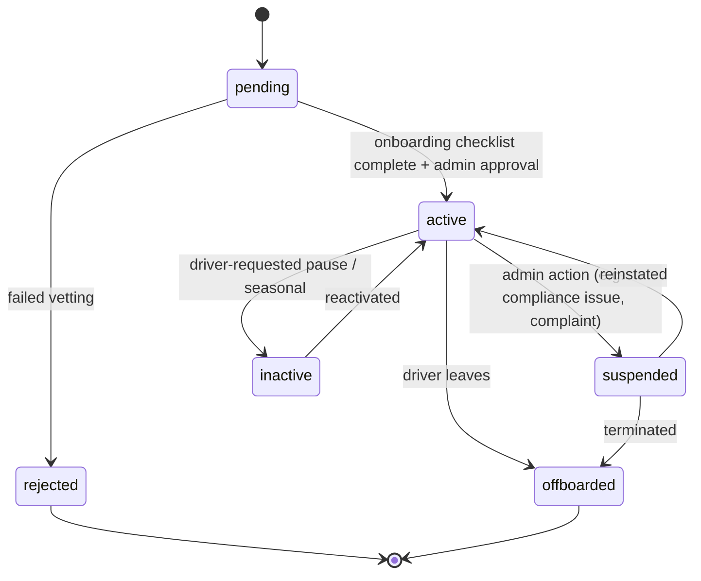

# Driver Lifecycle

Owned by the `drivers` module.

## States

| Status | Meaning | Can be dispatched? |
|---|---|---|
| `pending` | Applied, onboarding in progress. | No |
| `active` | Fully onboarded, available for assignment (subject to their own availability toggle — see below). | Yes |
| `suspended` | Temporarily blocked (compliance issue, complaint under review, expired document). | No |
| `inactive` | Voluntarily paused (e.g. seasonal driver, leave). | No |
| `rejected` | Did not pass vetting. Terminal. | No |
| `offboarded` | No longer with the company. Terminal — history is retained (bookings keep their `driver_id` for record-keeping). | No |

## Onboarding checklist (`pending → active`)

Required before an admin can approve a driver:

1. Driving license on file, not expired (`license_expiry_date` in the future).
2. NCC authorization on file (`ncc_license_number`) — **confirm exact Italian compliance requirements with the founder**; this is modeled minimally today (see [open questions](README.md#open-questions-requiring-the-founders-confirmation-before-phase-1-build-out)).
3. At least one vehicle assigned (`primary_vehicle_id` set) with valid `insurance_expiry_date`.
4. Contract/terms signed (Phase 1: tracked as a manual admin checkbox; e-signature integration is a later refinement, not required to ship Phase 1).
5. Background check completed (manual, off-platform in Phase 1 — just an admin approval step).

Phase 1 does **not** build a self-service driver application form — drivers are onboarded by the admin directly (matches "already operating, small team" reality). A self-service application flow is a Phase 2+ candidate if hiring volume grows.

## Availability

Phase 1: a simple `is_available_now` boolean the driver toggles in the PWA/admin, checked at dispatch time alongside the overlapping-assignment check (see [Dispatch Logic](08-dispatch-logic.md)). Full shift/schedule management (recurring weekly availability, time-off requests) is **Phase 2+** — not needed to replace the current manual (WhatsApp) process, which also has no formal shift system today.

## Document expiry monitoring

`license_expiry_date`, `ncc_license_number` validity, and `insurance_expiry_date` (via the driver's vehicle) should be monitored and flagged before they lapse — an expired license shouldn't silently allow continued dispatch. Phase 1: a simple admin dashboard warning (query drivers/vehicles with expiry within N days). Automated reminders to the driver are a [notification flow](10-notifications.md) candidate for Phase 2.

## Events emitted

| Event | Fired on | Consumed by |
|---|---|---|
| `driver.activated` | `pending → active` | `notifications` (welcome message) |
| `driver.suspended` | `active → suspended` | `notifications` (internal alert), `dispatch` (must not assign) |
| `driver.offboarded` | `→ offboarded` | — |

Dispatch does not strictly need to *listen* for these if it queries `status = 'active'` directly at assignment time — listed here for completeness since other modules (e.g. notifications) do care about the transition itself, not just the current state.
