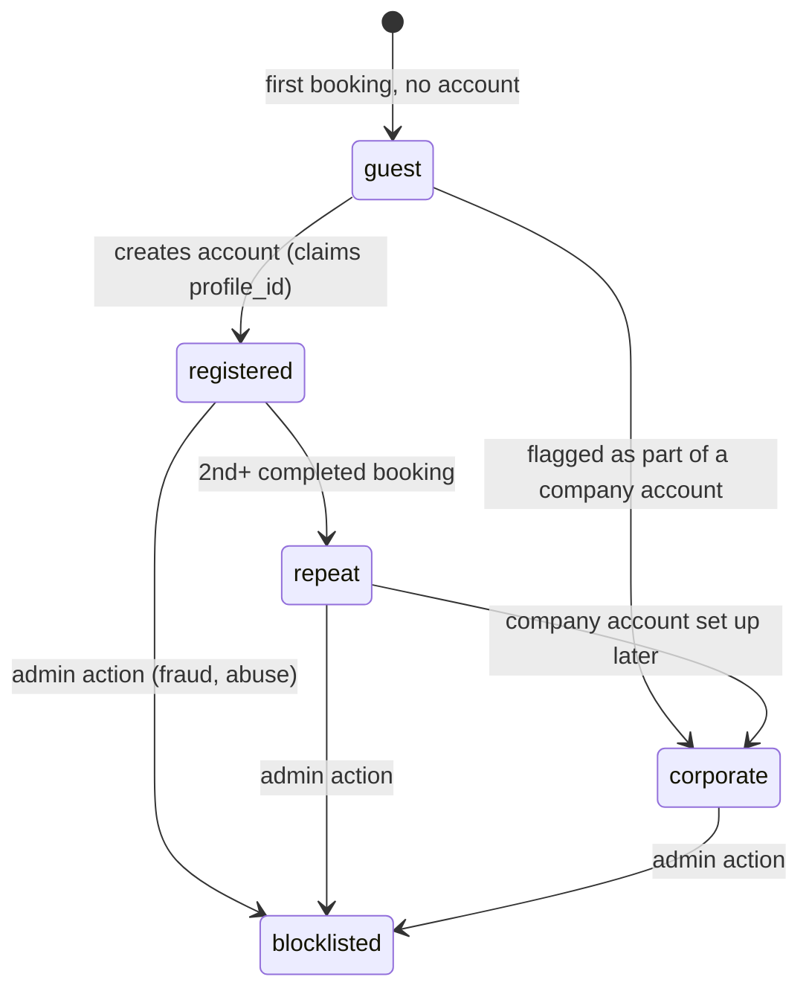

# Customer (Client) Lifecycle

Owned by the `clients` module. Unlike drivers, most clients pass through this system **without ever creating an account** — that's normal for an NCC/chauffeur business (one-off airport transfers booked by a hotel concierge, corporate travel coordinators booking for someone else, etc.), and the model must not force account creation to get a quote or book.

## States

| State | Meaning |
|---|---|
| `guest` | `clients` row exists, `profile_id` is null. Can book, receive confirmations/receipts by email/SMS, cannot log in. |
| `registered` | Has claimed or created a `profiles` row (`role = client`), can log in to view booking history. |
| `repeat` | Not a separate DB status — a derived label (2+ completed bookings) surfaced in the admin UI for ops awareness (e.g. VIP treatment), not a workflow gate. |
| `corporate` | `company_name` set and (Phase 2+) linked to a corporate billing arrangement — see [Invoicing](07-invoicing.md). |
| `blocklisted` | Admin-set flag preventing new bookings. Modeled as a boolean/flag on `clients`, not a replacement for the states above (a corporate client can be blocklisted without losing its corporate designation). |

## Account creation / claiming

A guest can later create an account with the same email used on a past booking. Phase 1 behavior: creating an account with a matching email links `profile_id` to the existing `clients` row rather than creating a duplicate — this must be handled deliberately (matched by verified email, not silently), since getting it wrong either fragments a client's history across two rows or lets someone claim another person's booking history via a guessed email. **This matching logic needs its own careful design in Phase 1**, not treated as an incidental detail.

## GDPR — consent

Bonolini Transfer operates in Italy (EU); GDPR applies (confirmed, see [CLAUDE.md](../../CLAUDE.md#assumptions-on-record)). Consent is captured via `consent_records` (see [Business Entities](01-business-entities.md)), not just a boolean on `clients`, so each grant/revocation has its own timestamp and source — needed for an actual compliance audit trail, not just a UX nicety.

- **Data processing consent** (required to operate at all — booking a ride inherently requires processing pickup/dropoff/contact info): captured implicitly at booking, with the privacy policy linked at the point of booking. Lawful basis: contract performance, not "consent" in the strict GDPR sense — worth getting an actual legal read on this distinction before Phase 2's data-export/delete work.
- **Marketing consent** (SMS/email promos): explicit opt-in, off by default, revocable at any time via a link in any marketing message.
- **Data subject rights** (export, delete): the `clients` module must expose the operations; the actual client-facing UI for exercising them is **Phase 2** (see [roadmap](../../CLAUDE.md#roadmap)), not Phase 1 — but the schema and module boundary should not make this hard to add later.

## Retention

Not fully specified here — flagged as a decision needed before Phase 2's data-export/delete work: how long is a `guest` client's data kept if they never book again? A reasonable default (e.g. delete/anonymize PII after N years of inactivity) needs the founder's input on N, and possibly legal advice given GDPR's storage-limitation principle.

## Events emitted

| Event | Fired on | Consumed by |
|---|---|---|
| `client.registered` | guest claims/creates an account | `notifications` (welcome) |
| `client.blocklisted` | admin flags a client | `bookings` (must reject new `draft` bookings) |
