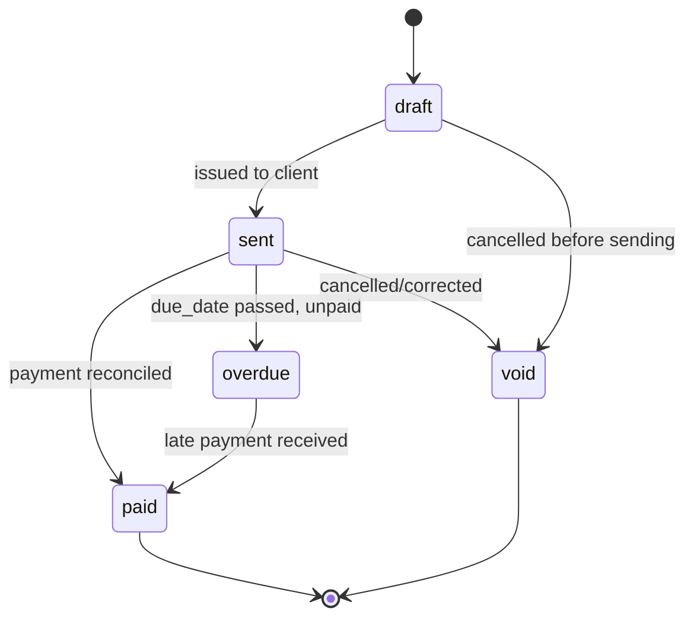

# Invoicing

Owned by the `billing` module.

## Two invoicing shapes

1. **Per-booking receipt** — an individual/guest client who paid by card at confirmation. This is a receipt for a payment already taken, generated automatically on `booking.completed`. One `invoices` row, one `invoice_line_items` row.
2. **Consolidated corporate invoice** — a corporate `invoice_account` client accumulates completed bookings unbilled, and an admin (or a scheduled job) generates a single invoice covering many bookings over a period (typically monthly). One `invoices` row, one `invoice_line_items` row per booking.

Both share the same `invoices`/`invoice_line_items` schema (see [Business Entities](01-business-entities.md)) — the difference is just how many bookings map to one invoice and whether it's auto-generated or admin-triggered.

## Numbering

`invoice_number` must be sequential **per tenant**, with no gaps, in issue order — this is a standard invoicing legal requirement in Italy (and most jurisdictions), not just good practice. Generate it at issue time (not at draft creation) via a per-tenant counter, not derived from the row's primary key.

## Compliance flag: Italian e-invoicing

**This needs confirmation with the founder / an Italian commercialista before Phase 1 billing work starts, not assumed here.** Italy has mandated electronic invoicing (*fatturazione elettronica*) transmitted through the *Sistema di Interscambio* (SDI) for most B2B and B2C transactions issued by Italian VAT-registered businesses. If Bonolini Transfer is subject to this (likely, as an operating Italian business), a plain PDF invoice is **not sufficient** for compliance — invoices need to be generated in the mandated XML format and transmitted via SDI, typically through a certified provider/API rather than built from scratch.

Consequence for the schema: `invoices.sdi_transmission_status` is already reserved in [Business Entities](01-business-entities.md) so this can be added without a schema change once the compliance requirement is confirmed and a provider is chosen. **Do not build a "PDF invoice generator" in Phase 1/2 as if that's the finish line** — treat it as a placeholder pending this confirmation.

## Tax

`tax_amount` reflects Italian VAT (IVA), computed from `price_breakdown.tax` on each contributing booking. The applicable rate itself is a fiscal question (confirm with the founder/commercialista — NCC services may have a specific rate), not decided in this document.

## Status lifecycle

For `card`-paid individual receipts, `draft → sent → paid` typically happens near-instantly (payment already succeeded before the receipt is generated). For corporate `invoice_account` billing, `sent → paid` may take weeks and `overdue` is a real, expected state.

## Credit notes

A refund against an already-issued invoice (see [Payments](06-payments.md#refund-execution)) requires a credit note, not a silent edit to a `paid` invoice — invoices are immutable once `sent` for the same audit-trail reasons as price snapshotting (see [Pricing Engine](05-pricing-engine.md)). Credit notes are **not modeled in Phase 1's schema** — flagged as a Phase 2 addition once real refund volume makes it necessary, since Phase 1's card-upfront model means most cancellations happen before an invoice ever exists.

## Events emitted

| Event | Fired on | Consumed by |
|---|---|---|
| `billing.invoice_created` | Invoice generated (draft or auto-sent) | `notifications` (send invoice/receipt to client) |
| `billing.invoice_overdue` | `due_date` passed unpaid (scheduled check) | `notifications` (payment reminder to client, alert to admin) |
