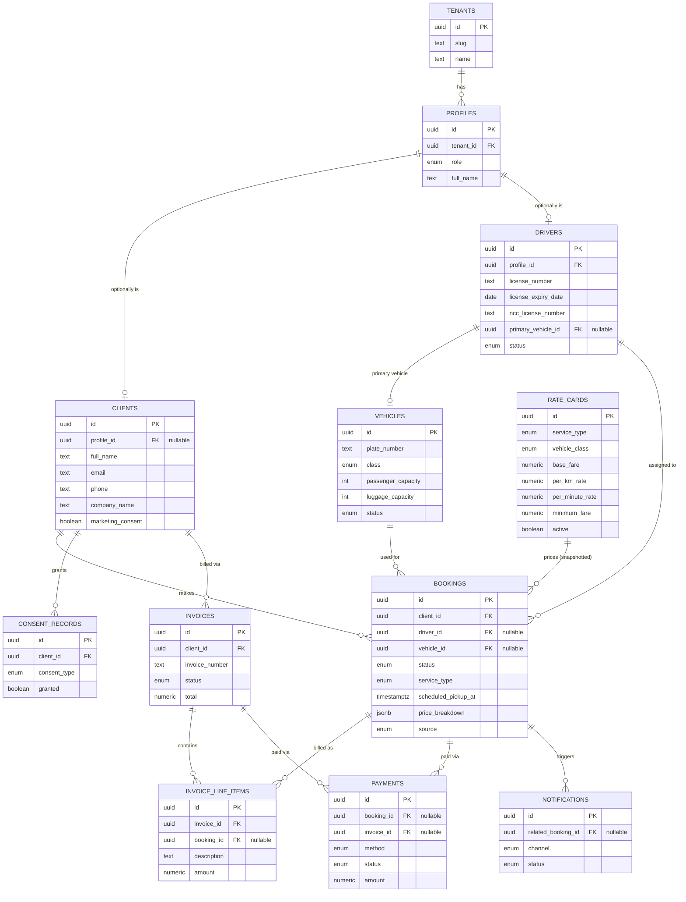

# Database ERD

Visual companion to [Business Entities](01-business-entities.md) — field-level detail lives there; this is the relationship map. `tenant_id` is on every table (see [ADR 0004](../adr/0004-tenant-id-multitenancy.md)) but omitted from the diagram for readability.

## Notes on relationships that aren't purely structural

- **`PROFILES ||--o| CLIENTS` and `PROFILES ||--o| DRIVERS` are both "optionally is," not "has."** A `profile` with `role = client` may or may not have a linked `clients` row depending on whether that person has ever booked — and a guest `clients` row may exist with **no** `profiles` row at all (see [Customer Lifecycle](04-customer-lifecycle.md)). This is the one place the diagram is easy to misread as a strict hierarchy; it isn't.
- **`RATE_CARDS ||--o{ BOOKINGS`" is a snapshot relationship, not a live one.** `booking.price_breakdown` freezes the computed price at confirmation time; `rate_card_id` is kept for traceability only (see [Pricing Engine](05-pricing-engine.md#why-the-result-is-a-frozen-snapshot-not-a-live-calculation)). Changing a rate card never changes an existing booking's price.
- **`BOOKINGS ||--o{ INVOICE_LINE_ITEMS`" is many-to-many at the invoice level** even though each line item points at one booking — one booking generates one line item (its own receipt), but one invoice can aggregate line items from many bookings (corporate consolidated billing). See [Invoicing](07-invoicing.md).
- **Row Level Security**, not shown in this diagram, additionally scopes every table by `tenant_id`, and (per [Roles & Permissions](09-roles-permissions.md)) will scope `bookings`/`drivers`/`clients` further by role in Phase 1 — a `driver` only sees rows where `driver_id` matches their own `drivers.id`, a `client` only sees rows where `client_id` matches their own.
